# 🚀 VN30 QUANTUM CORE: Autonomous AI Trading Protocol

> **"Sleeping is for humans. The Market never sleeps, and neither does this code."**

[](https://github.com/longtho638-jpg/vn30-quantum)
[](https://www.docker.com/)
[](https://www.python.org/)
[](LICENSE)

---

## 🏛️ 1. SYSTEM ARCHITECTURE

Hệ thống được thiết kế theo mô hình **Microservices Event-Driven**, đảm bảo tính biệt lập, khả năng mở rộng và bảo mật tuyệt đối.

```mermaid
graph TD
    subgraph "INTERNET (PUBLIC)"
        User[👨‍💻 YOU - Trader]
        Cloudflare[☁️ Cloudflare Zero Trust]
    end

    subgraph "VPS - THE FORTRESS (PRIVATE NETWORK)"
        Tunnel[🚇 Cloudflare Tunnel]
        Nginx[🚪 Nginx Reverse Proxy]
        
        subgraph "DATA LAYER"
            InfluxDB[(🛢️ InfluxDB Time-series)]
            Redis[(💾 Redis Cache)]
        end
        
        subgraph "AGENTIC LAYER"
            Hunter[🕵️ Agent Hunter]
            Analyst[🧠 Agent Oracle]
        end
        
        subgraph "VISUALIZATION"
            Grafana[📊 Grafana Dashboard]
        end
    end

    subgraph "EXTERNAL"
        VNStock[📈 HOSE/VN30 Data]
        Telegram[📱 Telegram Alert]
    end

    VNStock -->|Real-time| Hunter
    Hunter -->|Write| InfluxDB
    InfluxDB -->|Read| Analyst
    Analyst -->|Signal| InfluxDB
    Analyst -->|Alert| Telegram
    
    User -->|HTTPS + OTP| Cloudflare
    Cloudflare -->|Tunnel| Tunnel
    Tunnel --> Nginx
    Nginx --> Grafana
    Grafana -->|Query| InfluxDB
```



---

## 💎 2. CORE FEATURES

### 🕵️ The Hunter (Data Collector)

| Feature | Description |
|---------|-------------|
| **Multi-threading** | 10 workers quét 30 mã VN30 < 2 giây |
| **Auto-Healing** | Tự động kết nối lại khi API ngắt |
| **Batch Write** | Ghi hàng loạt vào InfluxDB |
| **Data Source** | vnstock (TCBS High-speed API) |

### 🧠 The Oracle (AI Analyst)

| Feature | Description |
|---------|-------------|
| **RSI** | Relative Strength Index (14 periods) |
| **MACD** | Moving Average Convergence (12, 26, 9) |
| **Bollinger** | Bands với 2σ deviation |
| **AI Prediction** | Linear Regression dự báo giá |
| **Signal Engine** | STRONG_BUY → STRONG_SELL |

### 🛡️ The Iron Dome (Security)

| Layer | Protection |
|-------|-----------|
| **Cloudflare CDN** | DDoS, WAF |
| **Zero Trust Tunnel** | No ports exposed |
| **Access Policy** | Email OTP authentication |
| **Private Network** | 172.28.0.0/16 isolation |

---

## 📂 3. PROJECT STRUCTURE

```
vn30-quantum/
├── docker-compose.yml      # 🎯 Orchestrator
├── .env.example            # 🔐 Environment template
├── nginx/
│   └── nginx.conf          # 🚪 Gatekeeper config
├── hunter/
│   ├── Dockerfile
│   ├── requirements.txt
│   ├── config.py
│   └── main.py             # 🕵️ Data collector
├── analyst/
│   ├── Dockerfile
│   ├── requirements.txt
│   └── main.py             # 🧠 AI Oracle
├── frontend/               # 📱 Next.js Dashboard
├── backend/                # ⚡ FastAPI Backend
├── alerts/                 # 🔔 Telegram/Email
├── ai_engine/              # 🤖 ML Models
├── monitoring/             # 📊 Prometheus/Grafana
└── docs/
    ├── GRAFANA_SETUP.md
    ├── VPS_DEPLOYMENT.md
    └── CLOUDFLARE_TUNNEL.md
```

---

## ⚡ 4. QUICK DEPLOYMENT

### Prerequisites

- VPS Ubuntu 22.04+ (2GB RAM minimum)
- Docker & Docker Compose
- Cloudflare account (for Tunnel)
- Telegram Bot Token (optional)

### Step 1: Clone

```bash
git clone https://github.com/longtho638-jpg/vn30-quantum.git
cd vn30-quantum
```

### Step 2: Configure

```bash
cp .env.example .env
nano .env
```

```env
# Required
TUNNEL_TOKEN=your_cloudflare_tunnel_token
INFLUX_TOKEN=your_secure_token

# Optional
TELEGRAM_BOT_TOKEN=your_bot_token
TELEGRAM_CHAT_ID=your_chat_id
```

### Step 3: Deploy

```bash
docker compose up -d --build
```

### Step 4: Verify

```bash
docker compose ps
```

Expected output:
```
NAME              STATUS
vn30_tunnel       running
vn30_gatekeeper   running (healthy)
vn30_grafana      running
vn30_influxdb     running (healthy)
vn30_redis        running (healthy)
vn30_hunter       running
vn30_analyst      running
```

---

## 🎮 5. OPERATING MANUAL

### Access Dashboard

```
https://dashboard.yourdomain.com
```
→ Enter Email → Receive OTP → Login

### View Logs

```bash
# Hunter (Data collection)
docker compose logs -f hunter

# Oracle (AI Analysis)
docker compose logs -f analyst

# All services
docker compose logs -f
```

### Update Code

```bash
git pull origin main
docker compose up -d --build
```

---

## 📊 6. GRAFANA QUERIES

### Price Chart
```flux
from(bucket: "market_data")
  |> range(start: v.timeRangeStart)
  |> filter(fn: (r) => r["_measurement"] == "stock_price")
  |> filter(fn: (r) => r["symbol"] =~ /^${symbol:regex}$/)
```

### AI Prediction
```flux
from(bucket: "market_data")
  |> range(start: v.timeRangeStart)
  |> filter(fn: (r) => r["_measurement"] == "strategy_signal")
  |> filter(fn: (r) => r["_field"] == "predicted_price")
```

### RSI Indicator
```flux
from(bucket: "market_data")
  |> range(start: v.timeRangeStart)
  |> filter(fn: (r) => r["_measurement"] == "strategy_signal")
  |> filter(fn: (r) => r["_field"] == "rsi")
```

---

## 🔮 7. ROADMAP

- [x] **Phase 1:** Core Infrastructure (Docker, InfluxDB, Grafana)
- [x] **Phase 2:** Real-time Data (VN30 Hunter)
- [x] **Phase 3:** AI Analysis (RSI, MACD, Bollinger)
- [x] **Phase 4:** ML Prediction (Linear Regression)
- [x] **Phase 5:** Telegram Alerts (Smart Cooldown)
- [x] **Phase 6:** Iron Dome Security (Nginx + Private Network)
- [x] **Phase 7:** Zero Trust (Cloudflare Tunnel)
- [ ] **Phase 8:** Auto-Trading (DNSE/SSI API)
- [ ] **Phase 9:** Deep Learning (LSTM/Transformer)

---

## 📈 8. PERFORMANCE

| Metric | Value |
|--------|-------|
| Stocks monitored | 30 (VN30 Index) |
| Scan interval | 10s (Hunter), 60s (Analyst) |
| Indicators calculated | 6 (RSI, MACD, BB, Stoch, SMA, EMA) |
| Prediction model | Linear Regression (30 candles) |
| Alert latency | < 2 seconds |
| Uptime target | 99.9% |

---

## 🛡️ 9. SECURITY

| Aspect | Implementation |
|--------|----------------|
| **Ports exposed** | 0 (Zero Trust) |
| **Authentication** | Email OTP via Cloudflare |
| **Encryption** | TLS 1.3 (Cloudflare) |
| **Network** | Private Docker bridge |
| **Rate limiting** | 10 req/s (Nginx) |
| **Headers** | X-Frame-Options, X-XSS-Protection |

---

## 🤝 10. CONTRIBUTING

1. Fork the repository
2. Create feature branch (`git checkout -b feature/amazing`)
3. Commit changes (`git commit -m 'Add amazing feature'`)
4. Push to branch (`git push origin feature/amazing`)
5. Open a Pull Request

---

## 📝 11. LICENSE

This project is licensed under the MIT License - see the [LICENSE](LICENSE) file for details.

---

## 👨‍💻 12. AUTHOR

**VN30-Quantum** - Built with ❤️ and ☕

> *"In a world of noise, the algorithm is the signal."*

---

## ⚠️ DISCLAIMER

This software is for educational and research purposes only. Trading stocks involves substantial risk of loss. Past performance is not indicative of future results. The authors are not responsible for any financial losses incurred through the use of this software.

---

**🚀 Happy Trading!**
